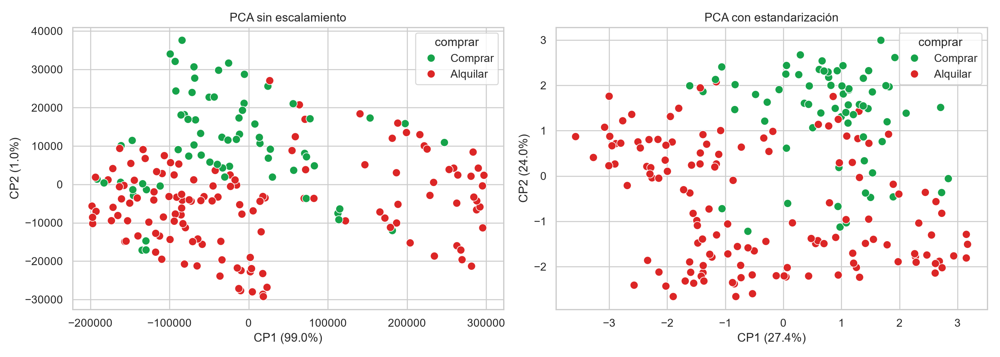
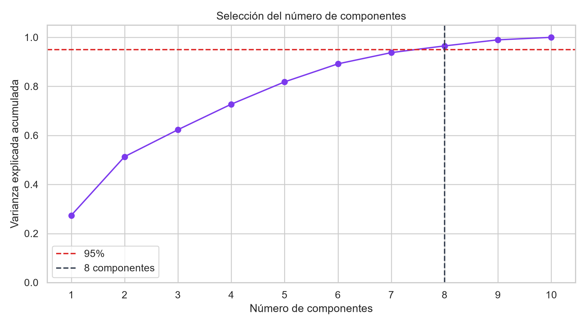
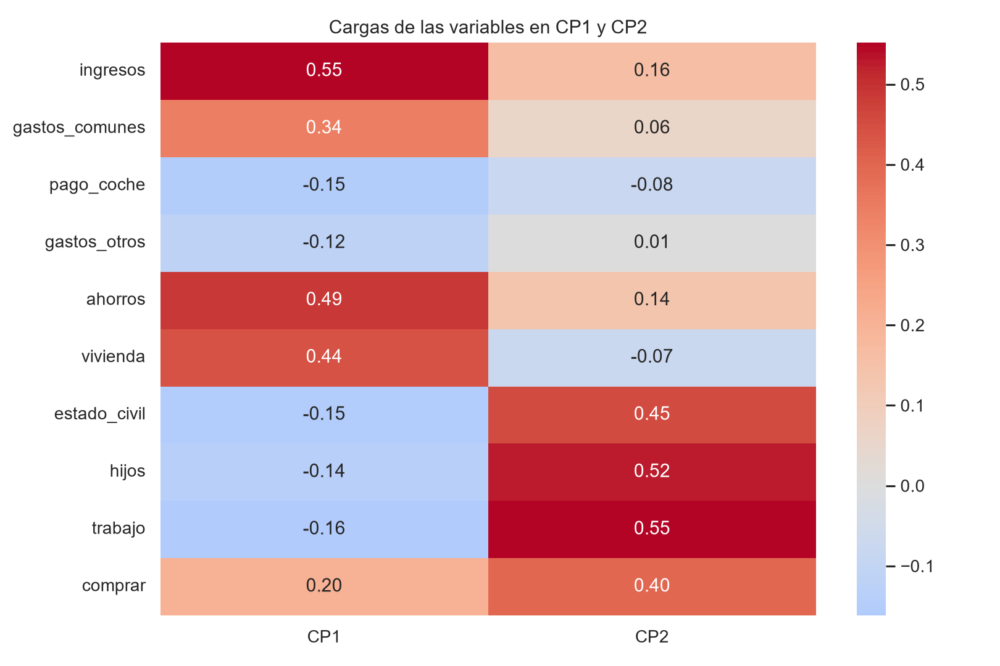

# SA — Reducción de dimensionalidad con PCA

Proyecto de aprendizaje no supervisado basado en el conjunto de datos `comprar_alquilar.csv`.

El objetivo es reducir las diez variables originales a una cantidad menor de componentes, conservando la mayor cantidad posible de información.

También se comparan los primeros dos componentes principales:

- Sin aplicar escalamiento.
- Aplicando estandarización con `StandardScaler`.

## Algoritmo seleccionado

Se utilizó **Análisis de Componentes Principales**, conocido como PCA por sus siglas en inglés: *Principal Component Analysis*.

PCA transforma las variables originales en nuevas variables llamadas componentes principales.

Sus características principales son:

- Los componentes son combinaciones de las variables originales.
- Los componentes no están correlacionados entre sí.
- Se ordenan de mayor a menor varianza explicada.
- Permite reducir la cantidad de dimensiones.
- Conserva la mayor cantidad posible de información.
- Permite representar datos con muchas variables en una gráfica bidimensional.

## Conjunto de datos

El archivo `comprar_alquilar.csv` contiene información económica, familiar y laboral relacionada con la decisión de comprar o alquilar una vivienda.

El conjunto contiene:

- 202 registros.
- 10 variables.
- 0 valores faltantes.

Las columnas son:

| Variable | Descripción |
|---|---|
| `ingresos` | Ingresos de la persona. |
| `gastos_comunes` | Gastos comunes o habituales. |
| `pago_coche` | Cantidad destinada al pago del automóvil. |
| `gastos_otros` | Otros gastos personales. |
| `ahorros` | Cantidad de dinero ahorrado. |
| `vivienda` | Valor relacionado con la vivienda. |
| `estado_civil` | Estado civil codificado numéricamente. |
| `hijos` | Número de hijos. |
| `trabajo` | Situación laboral codificada. |
| `comprar` | Indicador de comprar o alquilar. |

La variable `comprar` se interpreta como:

```text
0 = Alquilar
1 = Comprar
```

En este ejercicio, PCA trabaja con las diez variables del conjunto. La columna `comprar` también se utiliza para asignar colores en las gráficas, pero PCA no recibe una variable objetivo separada ni intenta realizar una clasificación supervisada.

## Justificación de PCA

PCA fue seleccionado porque el conjunto contiene varias características con escalas y posibles relaciones diferentes.

El algoritmo permite:

1. Estandarizar las variables.
2. Examinar la información contenida en cada componente.
3. Reducir el número de dimensiones.
4. Mantener un porcentaje elevado de la varianza.
5. Visualizar los registros mediante los dos primeros componentes.
6. Analizar qué variables tienen mayor influencia.

El propósito no es predecir si una persona comprará o alquilará, sino representar el conjunto utilizando menos dimensiones.

## Diseño del análisis

El notebook desarrolla el siguiente procedimiento:

1. Importación de las bibliotecas.
2. Lectura del archivo `comprar_alquilar.csv`.
3. Exploración de dimensiones y estadísticas.
4. Revisión de valores faltantes.
5. Definición de las diez variables.
6. Aplicación de PCA sin escalamiento.
7. Estandarización con `StandardScaler`.
8. Aplicación de PCA sobre los datos estandarizados.
9. Comparación gráfica de los primeros dos componentes.
10. Cálculo de la varianza explicada.
11. Selección del número de componentes.
12. Reducción final del conjunto.
13. Exportación de los datos reducidos.
14. Análisis de las cargas de CP1 y CP2.
15. Guardado del escalador y PCA mediante Joblib.

## PCA sin escalamiento

Primero se aplicó PCA directamente sobre los datos originales:

```python
pca_raw = PCA().fit(X)
Zraw = pca_raw.transform(X)
```

Los resultados fueron:

| Componente | Varianza explicada |
|---|---:|
| CP1 | 98.9864 % |
| CP2 | 1.0065 % |
| CP1 + CP2 | 99.9928 % |

Los primeros dos componentes explican casi el 100 % de la varianza.

Sin embargo, este resultado se debe principalmente a que las variables monetarias tienen valores mucho mayores.

Por ejemplo:

- `vivienda` puede alcanzar valores superiores a 600,000.
- `ahorros` contiene valores de miles.
- `hijos` contiene valores entre 0 y 4.
- `comprar` solamente contiene 0 y 1.

Por esta razón, las variables monetarias dominan el cálculo de la varianza cuando no se utiliza escalamiento.

## Estandarización de los datos

Para evitar que las unidades de mayor magnitud dominaran PCA, se utilizó `StandardScaler`:

```python
scaler = StandardScaler()
Xs = scaler.fit_transform(X)
```

La estandarización:

- Resta la media de cada variable.
- Divide entre su desviación estándar.
- Coloca todas las variables en una escala comparable.
- Permite que cada característica tenga una participación más equilibrada.

Después se volvió a aplicar PCA:

```python
pca_scaled = PCA().fit(Xs)
Zscaled = pca_scaled.transform(Xs)
```

## Varianza explicada con escalamiento

Los resultados obtenidos después de estandarizar fueron:

| Componente | Varianza individual | Varianza acumulada |
|---:|---:|---:|
| CP1 | 27.3684 % | 27.3684 % |
| CP2 | 23.9587 % | 51.3271 % |
| CP3 | 10.9911 % | 62.3182 % |
| CP4 | 10.4111 % | 72.7293 % |
| CP5 | 9.1057 % | 81.8349 % |
| CP6 | 7.3525 % | 89.1875 % |
| CP7 | 4.5776 % | 93.7651 % |
| CP8 | 2.7450 % | 96.5101 % |
| CP9 | 2.4691 % | 98.9792 % |
| CP10 | 1.0208 % | 100.0000 % |

Los primeros dos componentes estandarizados explican:

```text
51.3271 %
```

Este resultado es menor que el PCA sin escalamiento, pero representa de manera más equilibrada la información de todas las variables.

## Comparación sin escalamiento y con escalamiento



Cada punto representa un registro del conjunto:

- Verde: comprar.
- Rojo: alquilar.
- Eje X: primer componente principal.
- Eje Y: segundo componente principal.

### PCA sin escalamiento

En la gráfica izquierda, los dos primeros componentes explican `99.9928 %`.

No obstante, la representación está dominada por las variables monetarias debido a sus unidades y magnitudes.

### PCA con escalamiento

En la gráfica derecha, los primeros dos componentes explican `51.3271 %`.

Aunque el porcentaje es menor, la representación es más equilibrada porque todas las variables fueron transformadas a una escala comparable.

PCA no intenta separar perfectamente los puntos verdes y rojos. Su objetivo es conservar la mayor varianza posible y no realizar una clasificación.

## Selección del número de componentes

Se estableció el criterio de conservar al menos el 95 % de la varianza acumulada.

El número se seleccionó mediante:

```python
cumulative = np.cumsum(
    pca_scaled.explained_variance_ratio_
)

n95 = int(
    np.argmax(cumulative >= 0.95) + 1
)
```

Los resultados cercanos al umbral fueron:

| Número de componentes | Varianza conservada | Decisión |
|---:|---:|---|
| 7 | 93.7651 % | No alcanza el 95 %. |
| 8 | 96.5101 % | Valor seleccionado. |
| 9 | 98.9792 % | Conserva más, pero reduce menos. |
| 10 | 100 % | No existe reducción. |

## Justificación de los 8 componentes

Se seleccionaron **8 componentes principales** porque es el número mínimo que conserva al menos el 95 % de la varianza.

Con ocho componentes se conserva:

```text
96.5101 %
```

La pérdida aproximada es:

```text
3.4899 %
```

La reducción obtenida fue:

```text
10 variables originales → 8 componentes principales
```

Se rechazaron siete componentes porque solamente conservaban `93.7651 %`, resultado inferior al umbral establecido.

No se seleccionaron nueve o diez componentes porque, aunque conservan más información, producen una reducción menor.

## Gráfica de varianza acumulada



La gráfica muestra:

- Eje X: número de componentes.
- Eje Y: varianza explicada acumulada.
- Línea horizontal roja: umbral del 95 %.
- Línea vertical: ocho componentes.

La gráfica demuestra que ocho es el primer número de componentes que supera el 95 %.

## Diferencia entre visualización y reducción final

Los primeros dos componentes se utilizan para representar los datos gráficamente porque una gráfica solamente puede mostrar fácilmente dos dimensiones.

Sin embargo, esos dos componentes conservan únicamente `51.3271 %` de la varianza estandarizada.

Por esa razón:

- Se usan 2 componentes para visualizar.
- Se usan 8 componentes para conservar información.

No existe contradicción entre ambos valores, ya que cumplen objetivos diferentes.

## Reducción final

El modelo final se entrenó con ocho componentes:

```python
final_pca = PCA(
    n_components=n95
).fit(Xs)

X_reduced = final_pca.transform(Xs)
```

Después se creó un DataFrame con los componentes:

```python
reduced = pd.DataFrame(
    X_reduced,
    columns=[
        f"CP{i+1}" for i in range(n95)
    ]
)

reduced["comprar_original"] = df["comprar"]
```

El nuevo conjunto contiene:

- 202 registros.
- CP1 a CP8.
- Una columna de referencia llamada `comprar_original`.

La columna `comprar_original` se conserva únicamente para relacionar cada registro reducido con su valor original.

## Archivo de datos reducido

El resultado fue guardado en:

```text
data/comprar_alquilar_reducido.csv
```

Su estructura es:

| CP1 | CP2 | CP3 | CP4 | CP5 | CP6 | CP7 | CP8 | comprar_original |
|---:|---:|---:|---:|---:|---:|---:|---:|---:|
| Componente | Componente | Componente | Componente | Componente | Componente | Componente | Componente | Referencia |

## Cargas de los componentes

Las cargas indican cuánto aporta cada variable original a cada componente:

```python
loadings = pd.DataFrame(
    pca_scaled.components_[:2].T,
    index=X.columns,
    columns=["CP1", "CP2"]
)
```



Un valor absoluto alto representa una contribución importante.

El signo indica la dirección de la relación:

- Positivo: la variable aumenta en la misma dirección del componente.
- Negativo: la variable aumenta en dirección contraria.
- Cercano a cero: menor participación en ese componente.

## Interpretación del primer componente

Las variables con mayor contribución positiva en CP1 son:

| Variable | Carga CP1 |
|---|---:|
| `ingresos` | 0.5493 |
| `ahorros` | 0.4894 |
| `vivienda` | 0.4413 |
| `gastos_comunes` | 0.3415 |

CP1 puede interpretarse principalmente como una dimensión económica relacionada con ingresos, ahorros, vivienda y gastos comunes.

## Interpretación del segundo componente

Las variables con mayor contribución positiva en CP2 son:

| Variable | Carga CP2 |
|---|---:|
| `trabajo` | 0.5517 |
| `hijos` | 0.5240 |
| `estado_civil` | 0.4538 |
| `comprar` | 0.3962 |

CP2 puede interpretarse como una dimensión relacionada con características laborales, familiares y la decisión de comprar.

Estas interpretaciones representan asociaciones matemáticas y no necesariamente relaciones causales.

## Modelo guardado

El modelo se encuentra en:

```text
models/pca_comprar_alquilar.joblib
```

Este archivo contiene:

- El objeto `StandardScaler`.
- El modelo PCA de ocho componentes.
- El orden original de las columnas.

Se guardan juntos porque los registros nuevos deben recibir exactamente el mismo escalamiento y conservar el mismo orden de variables.

## Cómo cargar el modelo

```python
import joblib

paquete = joblib.load(
    "models/pca_comprar_alquilar.joblib"
)

scaler = paquete["scaler"]
pca = paquete["pca"]
columnas = paquete["columnas"]

print("Columnas:", columnas)
print("Número de componentes:", pca.n_components_)
print(
    "Varianza conservada:",
    pca.explained_variance_ratio_.sum()
)
```

La salida esperada es:

```text
Número de componentes: 8
Varianza conservada: 0.9651
```

## Cómo reducir un registro nuevo

```python
import pandas as pd
import joblib

paquete = joblib.load(
    "models/pca_comprar_alquilar.joblib"
)

scaler = paquete["scaler"]
pca = paquete["pca"]
columnas = paquete["columnas"]

nuevo = pd.DataFrame([{
    "ingresos": 5000,
    "gastos_comunes": 900,
    "pago_coche": 200,
    "gastos_otros": 500,
    "ahorros": 40000,
    "vivienda": 350000,
    "estado_civil": 1,
    "hijos": 1,
    "trabajo": 5,
    "comprar": 1
}])

nuevo = nuevo[columnas]
nuevo_escalado = scaler.transform(nuevo)
nuevo_reducido = pca.transform(
    nuevo_escalado
)

print(nuevo_reducido)
```

El resultado será un arreglo con ocho valores correspondientes a CP1 hasta CP8.

## Estructura del repositorio

```text
SA-PCA-Comprar-Alquilar/
├── pca_comprar_alquilar.ipynb
├── README.md
├── requirements.txt
├── data/
│   ├── comprar_alquilar.csv
│   └── comprar_alquilar_reducido.csv
├── models/
│   └── pca_comprar_alquilar.joblib
└── images/
    ├── comparacion_pca.png
    ├── varianza_acumulada.png
    └── cargas_pca.png
```

## Instalación

Para instalar las dependencias:

```bash
pip install -r requirements.txt
```

También pueden instalarse manualmente:

```bash
pip install pandas numpy matplotlib seaborn scikit-learn joblib jupyter
```

## Ejecución

Para abrir el proyecto:

```bash
jupyter notebook
```

Después se debe abrir:

```text
pca_comprar_alquilar.ipynb
```

Finalmente, seleccionar:

```text
Kernel → Restart & Run All
```

El archivo `comprar_alquilar.csv` debe encontrarse dentro de la carpeta `data`, porque esa es la ruta utilizada por el notebook.

## Resultados principales

| Resultado | Valor |
|---|---:|
| Variables originales | 10 |
| Componentes para visualización | 2 |
| Varianza de 2 CP sin escalar | 99.9928 % |
| Varianza de 2 CP estandarizados | 51.3271 % |
| Componentes finales | 8 |
| Varianza final conservada | 96.5101 % |
| Pérdida aproximada | 3.4899 % |

## Conclusión

El proyecto implementa correctamente un proceso de reducción de dimensionalidad mediante PCA.

El notebook carga y explora los datos, compara PCA sin escalamiento y con estandarización, calcula la varianza explicada, selecciona automáticamente el número de componentes, transforma el conjunto, analiza las cargas y guarda el modelo final.

La comparación demuestra que aplicar PCA directamente provoca que las variables monetarias dominen los resultados.

Después de utilizar `StandardScaler`, las diez variables participan desde una escala comparable.

Se seleccionaron ocho componentes porque es el número mínimo que conserva al menos el 95 % de la varianza. La solución final conserva `96.5101 %` y pierde aproximadamente `3.4899 %` de información.

## Autor

**Aldo Jair García Pacheco**  
Universidad Tecnológica de Querétaro  
Asignatura: Extracción de conocimiento en base de datos
